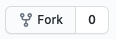
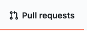
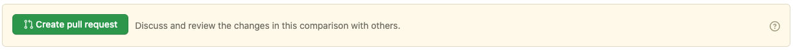

# README.md

## Introduction

Following is the documentation relative to how this site works and how can you contribute for documentation. You'll be guided in how to use Jekyll, on how to understand the project structure and finally how to add new material. Here's the table of content to make it easy to navigate this readme sections

## Jekyll's project structure

Leapp's website is made in [Jekyll](https://jekyllrb.com/), a simple yet powerful set of ruby gems to create a dynamic websites which can be staticised and put, as in our case, on **github pages**. The **template is custom made** to suite our needs and is created to allow easy contributions as there are only few places where you need to make changes.

Let's see how the project's folder structure is defined:


Now you'll be guide through every folder to understand what is its purpose.

### _data

In this folder we put **.yml** files which contain data injected dynamically in the site pages to organize useful information and make it simple for developers and non-developers to adjust them on need. An example is given by the file **features.yml** which contains data to describe content inside the `partial` **features.html** inside **_includes. You'll see later** what is a **partial** and how it can be used. 


As you can see the data is structured as a **.yml** file in which we have the page `title` and a set of  `features`  here, you can define every kind of variables that will be recovered and shown int the template we decide to include the file in.

Let's see it in this example:

```html
<section id="features">
    <div class="container">
        <h2>{{site.data.features.title}}</h2>
        <div class="features-holder">
            
                
                <div class="feature {{c}}">
                    <div class="video">
                        <video controls="controls" autoplay="autoplay" muted="muted" loop="loop"><source src="{{site.url}}{{site.baseurl}}/assets/videos/{{item.video}}" type="video/mp4" /></video>
                    </div>
                    <div class="content">
                        <h3>{{ item.title }}</h3>
                        
                        {{ p | markdownify }}
                    </div>
                    <div class="clearfix"></div>
                </div>
            
        </div>
    </div>
</section>
```

Anyone can access and use variables and data from the **.yml** files in the *data folder using `{{site.data.<NAME_*OF_FILE>.<NAME_OF_VARIABLE>}}` like **{{site.data.features.title}}.** As you can see data is mixed with HTML to create **microtemplates** which can then be **included in main pages**.

### _includes

In this folder you can see all the **microtemplates** used for organising code and make it simple to modify/maintain. these can be included in the main pages using the following sintax: 

``. Every **microtemplate** in the **_include folder** is used for pages in the **_layouts** folder. Let's see a simple example on how a **microtemplate** is done.

```html
<nav>
    <div class="container">
        <div>
            
            <h4>{{site.navbar_title}}</h4>
        </div>
        <ul>
            <li><a title="Features" href="#features">Features</a></li>
            <li><a title="Blog" href="{{site.blog_url}}">Blog</a></li>
            <li><a title="Docs" href="/documentation">Docs</a></li>
            <li><a title="Downlad" href="{{site.github_download_url}}">Download</a></li>
            <li><a title="Twitter" href="{{site.twitter_url}}"><i class="fab fa-twitter"></i></a></li>
            <li><a title="Facebook" href="{{site.facebook_url}}"><i class="fab fa-facebook"></i></a></li>
            <li><a title="Github" href="{{site.github_url}}"><i class="fab fa-github"></i></a></li>
        </ul>
    </div>
</nav>
```

### _layouts

Layouts are used to define **how a page is shown** in the site: they are linked to the **markdown** files in the _**pages**  section of the project' structure. A layout can contain **HTML** and **Liquid** code to define both static and dynamic content. Here a simple example of how the main page is defined:

```html
<!DOCTYPE html>
<html>
    
    <body>
        
        
        
        
         
         
        
    </body>
</html>
```

You can see that we have described the entire page as **collection** **of** **microtemplates**, each one **pointing to a specific section** of the page each with **specific information** contained both in the **_include** area and in the **_data** area.

### _pages

**Pages are the core of the structure as they present the end content**. They are written in markdown and contains information about where the content will be presented as well as **other important SEO information**.


**index.markdown** is used a simple anchor to the main page as its content is managed via the **_data** subfolder as we have seen before. 

```yaml
---
title: Leapp - The definitive Credential Manager
description: Leapp - The best general purpose Credential generator in the world
permalink: /
layout: default
---
```

It doesn't contains any markdown **but 4 important properties you must know how to use**:

- **title**: the title of the page presented in the address bar as well as in SEO meta.
- **description:** the description of the page in the SEO meta.
- **permalink:** defines the route of the page, that is very important as we have defined a custom directories' structure so you need to always specify the url in the permalink option.
- **layout:** define the layout you want to use to present your content.

### _posts

Posts are not used at this very moment, but it will be used in the future. They are described with a name which follows this structure: . And contains the following properties:

```
---
layout: default
title:  "Welcome to Jekyll!"
description: My awesome description
date:   2020-06-08 14:54:10 +0200
categories: jekyll update
---

```

- **layout**: which points to a possibile new layout
- **title**: the title of the post (which is also used for SEO purposes)
- **description**: the description of the post (which is also used for both the excerpt of the page and for SEO purposes)
- **date**: 2020-06-08 14:54:10 +0200 follow this structure YYYY-MM-DD hh:mm:ss Z (the date of the post)
- **categories**: add some categories to the post

Then you can put your markdown content.

### _site

Is managed directly by Jekyll and contains the staticised site. Don't modify it as it changes directly reflecting your modifications.

### assets

Contains **css, images, and any other media** of the site we want to include in the pages. To include an assets you ave to use the following syntax to **represent the url** of the resource (you have to manually add resources to the folder too):

`{{site.url | absolute_url}}{{site.baseurl}}/assets/<any-other-folder-if-present>/<name-of-the-file-with-extension>`

Example:

``

Our site supports both css and scss: in case you want to use scss you can take advantage of the **partials** directory inside css to store your sass in order to include them in the **main.css**

### _config.yml

Contains some basic configurations to define some global site properties, like twitter or facebook accounts, global title and description and so on. You can normally see it and modify properties as you see fit. You can see the actual values of **_config.yml** here: 

For enabling sass and css minification refer to these properties:

```yaml
sass:
  sass_dir: assets/css/partials
  style: compressed
```

You can see the complete **_config.yml** structure ****[here](https://github.com/Noovolari/leapp/blob/master/_config.yml)

## How to contribute to documentation directly without installing anything

Contributing for documentation can be done directly from github like shown here: [https://github.com/Noovolari/leapp/edit/master/_pages/docs/000_documentation.markdown](https://github.com/Noovolari/leapp/edit/master/_pages/docs/000_documentation.markdown). Generally speaking you can go directly to the site github page: [https://github.com/Noovolari/leapp](https://github.com/Noovolari/leapp)

This is by far the simplest way to edit already existing documentation as you have direct access to it without installing anything. 

This allows you to access every file directly form github which is the simpliest way to apply updates. However to make more advanced customization expecially on specific pages of the sites the next session is clearly a more appropriate approach.

Every time you edit a file online or create a new one: a pull-request is prepared directly for you

## How to install Jekyll and this project for local development as a team contributor

- clone the project from our repository using a software like [https://www.sourcetreeapp.com/](https://www.sourcetreeapp.com/) or via bash using this guide: [https://docs.github.com/en/github/creating-cloning-and-archiving-repositories/cloning-a-repository](https://docs.github.com/en/github/creating-cloning-and-archiving-repositories/cloning-a-repository) or if you know it just using: `git clone [https://github.com/YOUR-USERNAME/YOUR-REPOSITORY](https://github.com/YOUR-USERNAME/YOUR-REPOSITORY)` or if you have a copy of the project already you can use: `git checkout master` in a folder of your choice which will contains the project.
- Verify that you have at least **ruby 2.6.3** installed on your machine. You can either install ruby globally or via ruby env. to keep things cleaner, please use `ruby -v` in your folder of choice to verify your ruby version. If you don't have ruby installed follow this guide: [https://www.ruby-lang.org/it/documentation/installation/](https://www.ruby-lang.org/it/documentation/installation/) which contains useful information on how to install it for different type of OS. **For Mac users** which is our main development platform we suggests using [rbenv](https://www.ruby-lang.org/it/documentation/installation/#rbenv) or [RVM](https://www.ruby-lang.org/it/documentation/installation/#rvm).
- Once ruby is installed and the project is cloned you can simply use your editor of choice and a terminal to make it work locally following these suggestions:
    - Open the folder in your editor of choice, for example we suggests [WebStorm](https://www.jetbrains.com/webstorm/) from IntelliJ which gives autocompletion and a high level flexibility or [Visual Studio Code](https://code.visualstudio.com/) for a more lightweight editor.
    - Navigate to the project folder and either from the WebStorm terminal or your terminal run the following commands:

```bash
$ gem install bundler (if you don't have it already)
$ bundle install 
$ bundle exec jekyll serve
```

If everything is ok you'll se something like this in your terminal at the end of all the operations:


As you can see the terminal is pointing you to a local ip address (**127.0.0.1:4000/leapp/**) which is used to show the site. Everytime you make an update to the site, this is reflected here. Also the content of **_site** changes accordingly (as specified before, containing the built version of the site). 

If for some reasons you don't see the update. Press CTRL+C in the terminal and then type **bundle exec jekyll serve** again to regenerate the site (the process is quite fast)

## How to push new changes

To do that you have to install the project locally as described in the previous step. By doing that you have complete controls on the files. Remember **if you're adding a new markdown file for the documentation, refer to the naming convention to assure that it's position in the sidebar's menu is correct.**

```bash
$ git add .
$ git commit -m "<ADD_YOUR_COMMIT_MESSAGE_HERE>" // use it to describe what you're update was about
$ git push origin master
```

## How to make changes to the project locally without being a team member

Sometimes using git online helper for making changes is not enough especially if you want to contribute to the site's structure and so on. for that is better to download the project locally by making a fork. Add your changes and then request a pull-request.

### Prerequisites

Access to **your** github and then navigate to **our** project [url](https://github.com/Noovolari/leapp)

- Fork the project by click the fork icon on the top right corner of the project page



- Now the project is forked on your repository and already cloned.
- Apply your modifications.
- Push the changes on **your** origin.

```bash
$ git add .
$ git commit -m "<ADD_YOUR_COMMIT_MESSAGE_HERE>" // use it to describe what you're update was about
$ git push origin master
```

- Go to **pull request tab in your project fork!**



- Create a new pull request


- You will see the changes proposed by your commit. You can also verify that the base repository is Noovolari/leapp and head repository is yours.

- You just need to click create pull request:



- Insert details about your request and finalize creation.

## Jekyll Documentation

[Configuration Options](https://jekyllrb.com/docs/configuration/options/)
